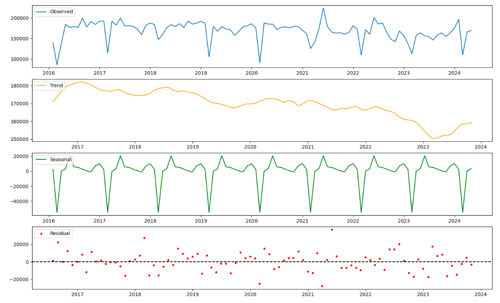
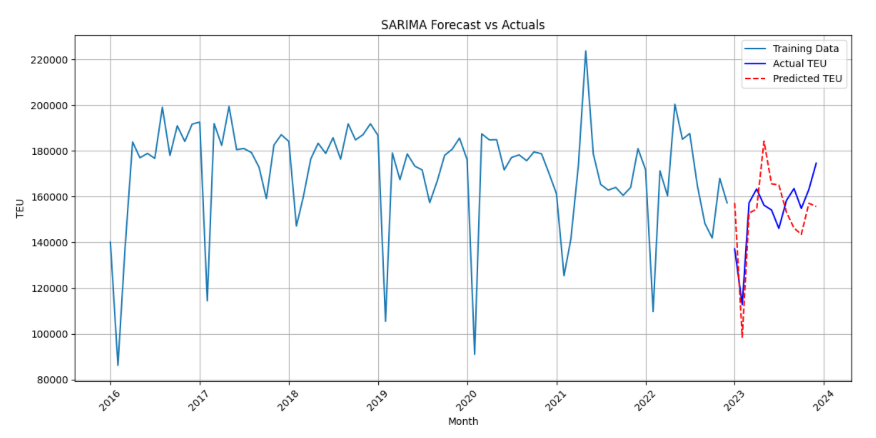

# 2024 Maritime-and-Port-Bureau-Innovative-Big-Data-Competition

## Overview
This project analyzes cross-strait trade between Taiwan and China using time series data from the Maritime and Port Bureau's iMarine database. We use SARIMA modeling to forecast TEU (Twenty-foot Equivalent Unit) trends for imports, exports, and transportation.

## Features
- Time series analysis of import/export/transport TEU data.
- SARIMA modeling for seasonal forecasting.
- Visualization of trends and forecast results.

## Dataset
The data is sourced from the Maritime and Port Bureau iMarine database and includes:
- 2016-2024 TEU import/export/transport data.
- Trade statistics for cross-strait trade between Taiwan and China.

### Data Structure
- `raw/`: Contains raw data files in `.csv` and `.xlsx` formats.
- `processed/`: Preprocessed and cleaned data files.

## Project Structure
```
Maritime-and-Port-Bureau-Innovative-Big-Data-Competition/
├── 兩岸TEU數:噸數:艘次/                        #data provided by iMarine database by Maritime and Port Bureau
│   ├── processed
│   │   ├── 8.TEU進出轉口合併                   #selected & merged TEU info from import/export/transport data
│   ├── raw
│   │   ├── 1.從中國進口貨櫃teu數.xlsx
│   │   ├── ....
│   │   ├── 兩岸貿易統計.csv
├── notebooks/exploratory
│   ├── test.ipynb
│   ├── test2.py
│   ├── test3.py
│   ├── testv2.py
├── scripts/
│   ├── predata.py
│   ├── prediction.py
│   ├── SARIMA.py
│   ├── trade.py
│   ├── tradeportion.py
├── visuals/
│   ├── decomposition.py
│   ├── monthlyGraph.py
├── requirements.txt
├── README.md
```

## Results
### Key Insights
- Transshipment trade accounts for the largest portion of cross-strait trade interactions.
- The volume of container imports from China at Kaohsiung Port shows a significant declining trend.
- In 2023, most ports experienced negative growth in container volume.
- During the pandemic in 2020, only Kaohsiung Port experienced negative growth.
- Every February, there is a significant drop in shipping trade volumes due to Chinese New Year Holidays.


### Sample Visualizations


Predicted and Actual Import TEU data
- mae = 19737.42
- mape = 13.11%
- rmse = 23755.61

## Challenges and Limitations
- Incomplete data for certain years may reduce forecasting accuracy.
- Model performance may vary due to external factors like economic conditions.

## Future Work
The team suggests using the SARIMAX multivariate model and incorporating the following variables:
- Economic Indicators: GDP growth rate, Consumer Price Index (CPI)
- Industry-Specific Data: Cross-strait trade volume (USD), oil prices
- Weather Data: Average temperature, rainfall (for time series related to agricultural and energy sectors)
- Market Conditions: Market demand, supply, price index
By conducting a correlation analysis, the relevant data can be included in the model to achieve more accurate predictions.

## Acknowledgments
- Maritime and Port Bureau for providing the iMarine database.
- Team members: 黃亮穎、李舲熏、李奕蓁、黃冠蓁、顏嘉緯、許銘聰
- Competition duration: 2024.05-2024.08
